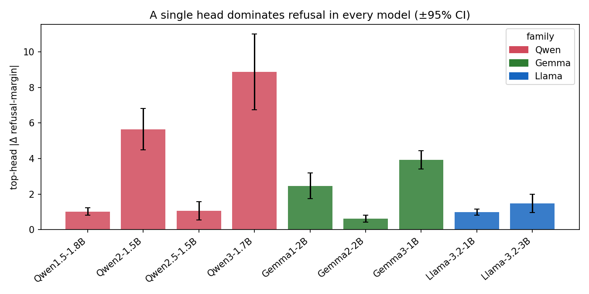
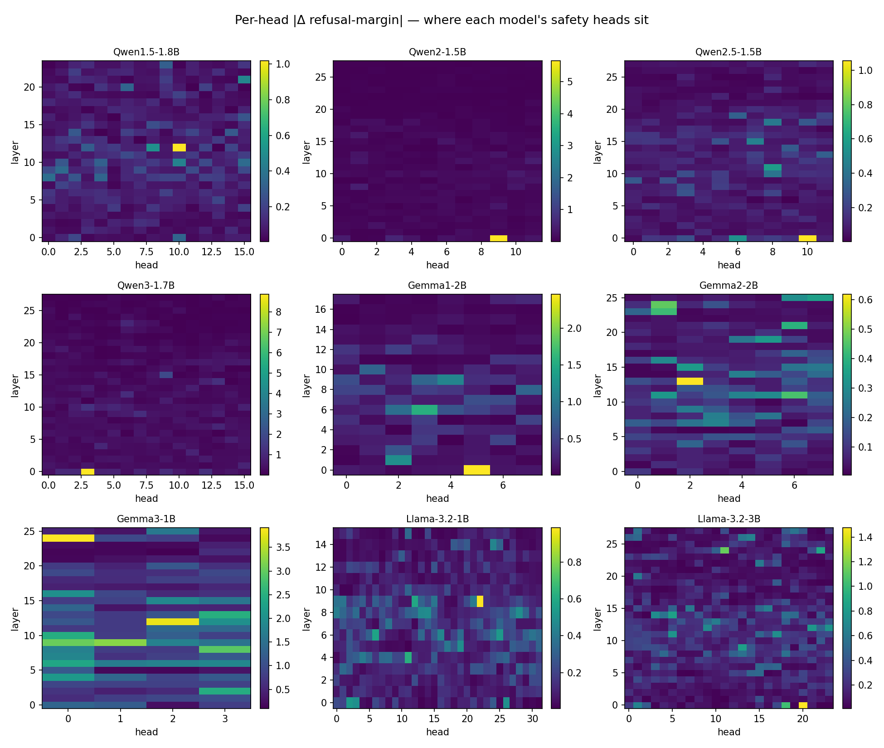
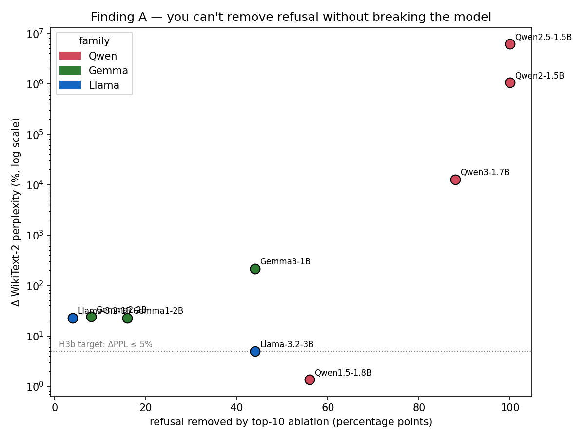
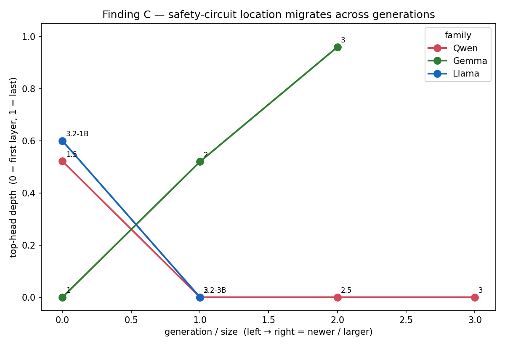
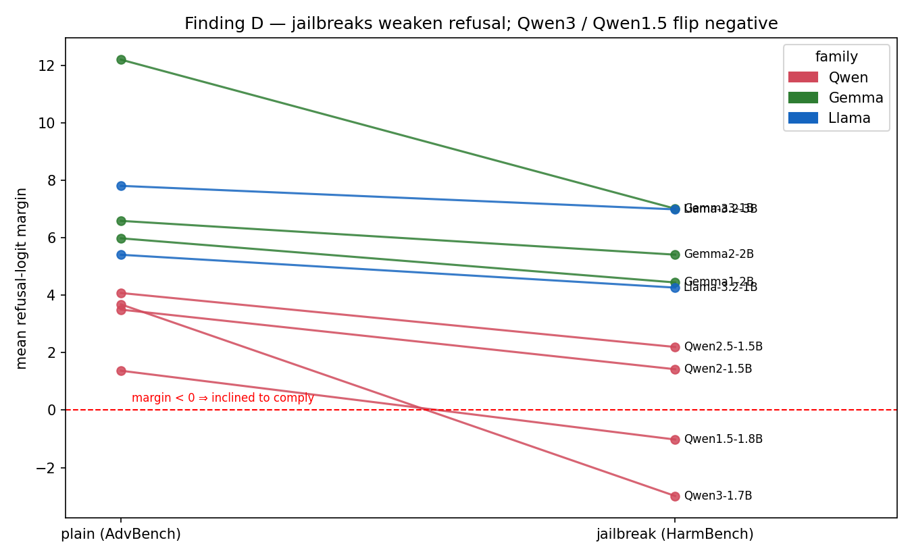

# Finding the Safety Switches: Refusal Circuits Are Concentrated but Not Modular

**Pranav Yadav** · MA-INF 4330 Lab Explainable AI and Applications, University of Bonn

> **Draft.** Results section fully drafted from the 9-model N=50 runs (`results/kaggle_neo/`,
> `FINDINGS.md`); figures generated by `scripts/make_figures.py` → `paper/figures/`. Other sections
> are stubs to be expanded; convert to LaTeX once the course paper format is confirmed.

---

## Abstract
*(stub)* — We use activation patching and ablation to localize the attention heads that causally
produce refusal of harmful instructions in nine small instruct LMs across three families
(Qwen, Gemma, Llama) and four Qwen / three Gemma generations. We find refusal is **causally
concentrated** in a few heads but **not modular**: removing it always damages general capability, and
how cleanly it can be removed depends on **where in the network** the circuit sits. We further show the
circuit's location **migrates across model generations**, and that jailbreak robustness is
non-monotonic with generation.

## 1. Introduction
*(stub)* — Motivation: safety is opaque; post-hoc XAI correlates, mechanistic interpretability reads
the wiring. Contribution: a cross-model, cross-generation causal map of refusal, plus a methodological
caution (refusal-rate without a capability control overstates "safety removal").

## 2. Related Work
*(stub)* — Activation patching / causal tracing (Meng et al.; Vig et al.), circuit analysis (IOI,
Wang et al.), refusal-direction / safety-interpretability work, jailbreak benchmarks (AdvBench,
HarmBench), RealToxicityPrompts.

## 3. Method
*(stub)* — Frozen models in TransformerLens; matched harmful/benign pairs (AdvBench × HH-RLHF, N=50);
refusal-logit-margin + regex metric; per-head `z`-patching (95% CIs over pairs); zero & mean ablation
of the top-10 heads; WikiText-2 perplexity capability control; K-sweep; last-token & attention-pattern
sweeps; HarmBench jailbreak stress test; RTP continuation-toxicity probe (`unitary/toxic-bert`).
9 instruct models; Phi-3 / Falcon3 / OLMo-2 / TinyLlama excluded (unsupported by the pinned TL).

---

## 4. Results

**Setup.** We study nine instruct-tuned models spanning three families and their generations/sizes:
Qwen (1.5-1.8B, 2-1.5B, 2.5-1.5B, 3-1.7B), Gemma (1-2B, 2-2B, 3-1B) and Llama-3.2 (1B, 3B). For each
model we run the full pipeline on N=50 matched (harmful, benign) prompt pairs with a fixed seed. All
per-model numbers below are in Table 1 (`paper/figures/summary_table.csv`).

### 4.1 Refusal is sparse and causal (H1, H2)

In every model a small number of attention heads — usually a single dominant head — carry most of the
refusal-logit margin under activation patching (Figure 1). The dominant head's effect is large relative
to the rest of the network and to its own 95% CI across pairs: e.g. **Qwen3-1.7B L0H3 = 8.87 ± 2.13**,
**Gemma-3-1B L24H0 = 3.92 ± 0.51**, **Qwen2-1.5B L0H9 = 5.65 ± 1.16**, **Qwen2.5-1.5B L0H10 = 1.06 ± 0.51**.
Patching a single head from a benign run into a harmful run measurably flips the refusal logit in all
nine models, confirming **H1 (sparsity)** and **H2 (causality)**. The per-head heatmaps (Figure 2) show
the heads are not scattered uniformly but cluster — and crucially, *where* they cluster varies by model
(§4.4).

### 4.2 Refusal is not modular: removal and capability damage are coupled (Finding A; H3, H3b)

Although refusal is *causally* concentrated, it cannot be *removed* cleanly. Figure 3 plots, for each
model, how much refusal the top-10 ablation removes against the resulting change in WikiText-2
perplexity. The two are tightly coupled: **the four models whose refusal collapses to 0% (Qwen2-1.5B,
Qwen2.5, Qwen3, Gemma-3) are exactly the four with the largest perplexity blow-up** — Qwen2.5 rises
from 18 to 1.1M (×61,000), Qwen2-1.5B 18→191k, Qwen3 32→4,058, Gemma-3 61→192. Models whose perplexity
barely moves (Llama-3.2-3B +5%, Gemma-1/2 +23–24%, Llama-3.2-1B +23%) only *partially* remove refusal.

Inspecting the generations confirms this is breakage, not compliance: under top-10 ablation Qwen2.5
emits gibberish (`"isUnnamed>()bobundeanimateaso…"`) and Qwen3 emits empty/degenerate text, rather than
fulfilling the harmful request (`paper`-side examples drawn from `*_examples.jsonl`). The "10 heads →
0% refusal" headline therefore **overstates** a clean safety switch. **H3 (refusal ≤30% under
ablation) holds** for five models but **H3b (and capability preserved, ΔPPL ≤5%) is falsified** for
every model that actually removes refusal — refusal is entangled with the heads the model needs to
generate coherent text (especially layer-0 heads).

### 4.3 Modularity scales with circuit depth (Finding B)

The *degree* of entanglement tracks *where* the dominant head sits. When it is **early (layer 0)**,
zeroing it is catastrophic — the Qwen models (top head at L0) lose coherence entirely (ΔPPL ×128 to
×61,000). When it is **late (layer 24)**, ablation is far gentler and the model stays coherent:
**Gemma-3-1B** (top head L24H0) removes refusal fully (44%→0%) at only +217% perplexity, and is the
**only** model where ablation produces *measurably more toxic continuation* on RTP (Δ toxicity
**+0.128**, vs ≤±0.04 for all others). In other words, only when the ablated model still generates
coherent text can "removing safety" yield actual harmful output — and that happens for the late-layer
circuit. The cleanest, most switch-like safety circuit we find is therefore **late-layer (Gemma-3 L24)**;
early-layer "safety" heads are better described as general-purpose heads that also gate refusal.

### 4.4 The safety circuit's location migrates across generations (Finding C)

Tracking the dominant head's depth across generations reveals a systematic, family-specific migration
(Figure 4). **Gemma pushes safety deeper every generation:** Gemma-1 L0 (first layer) → Gemma-2 L13
(mid) → Gemma-3 L24 (late) — a near-monotonic march toward the output. **Qwen moves in the opposite
direction:** Qwen1.5's top head is mid-network (L12), but from Qwen2 onward it sits at layer 0. Llama's
1B model is mid-network (L9) while the 3B is a hybrid with both an early (L0) and a late (L24) head —
the only model exhibiting both. This is a novel within-family result: *how* a family implements refusal
is not fixed but drifts across releases.

### 4.5 Jailbreak robustness is non-monotonic (Finding D)

Figure 5 contrasts the mean refusal-logit margin on plain harmful prompts (AdvBench) vs adversarial
jailbreaks (HarmBench). Robustness varies sharply and is *not* monotonic with generation or size.
**Gemma-2-2B is the most robust** (HarmBench refusal unchanged at 96%→96%) and **Llama-3.2-3B** even
refuses jailbreaks slightly *more* (88%→96%). In contrast **Qwen3 and Qwen1.5 are brittle**: their
refusal margin **flips negative** under HarmBench (+3.68→−2.99 and +1.37→−1.02), i.e. the models become,
on average, inclined to comply. Notably **the newest Qwen (3) is less jailbreak-robust than Qwen2.5**
(refusal 94%→42%), so newer is not safer. The same top-10 heads still gate refusal under jailbreak
(ablation → 0%), subject to the §4.2 capability caveat.

### 4.6 Summary
Across nine models: refusal is sparse and causal (H1/H2 ✓), but not modular — removal is coupled to
capability damage (H3b ✗), with modularity increasing for later-layer circuits; and circuit location
migrates across generations. Full per-model numbers: Table 1 (`figures/summary_table.csv`).

---

## 5. Discussion
*(stub)* — "Safety is mechanistic but entangled"; implications for unlearning / safety editing (you
can't excise refusal without collateral damage where it lives early); depth↔modularity as a design
lever; generational drift as a moving target for red-teaming; why capability controls are mandatory in
ablation studies.

## 6. Limitations
*(stub)* — Small models (≤3B) only; toxic-instruction-refusal axis only; refusal-token metric (audited
separately); Gemma generational comparison has a 2B→1B size confound (G3 has no 2B); zero/mean ablation
are blunt interventions; TransformerLens architecture coverage limited which set the model roster.

## 7. Reproducibility
*(stub)* — All code in `safety-circuits/`; per-model artifacts (pairs, sweeps, ablations, examples) in
`results/kaggle_neo/<model>/`; figures via `python scripts/make_figures.py`; seed 0; exact deps pinned;
runs on a single T4 (Kaggle), one model per session.
